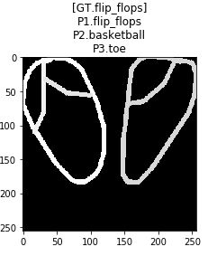

# Quickdraw-Doodle-Recognition
This project is aimed to solve the [Quickdraw-doodle-recognition](https://www.kaggle.com/c/quickdraw-doodle-recognition).  
I use the ResNeXt architecture to do the recognition. The result accuracy is 92.46%, which is top 18% among 1,316 teams. 

### Example Input & Prediction 
  
